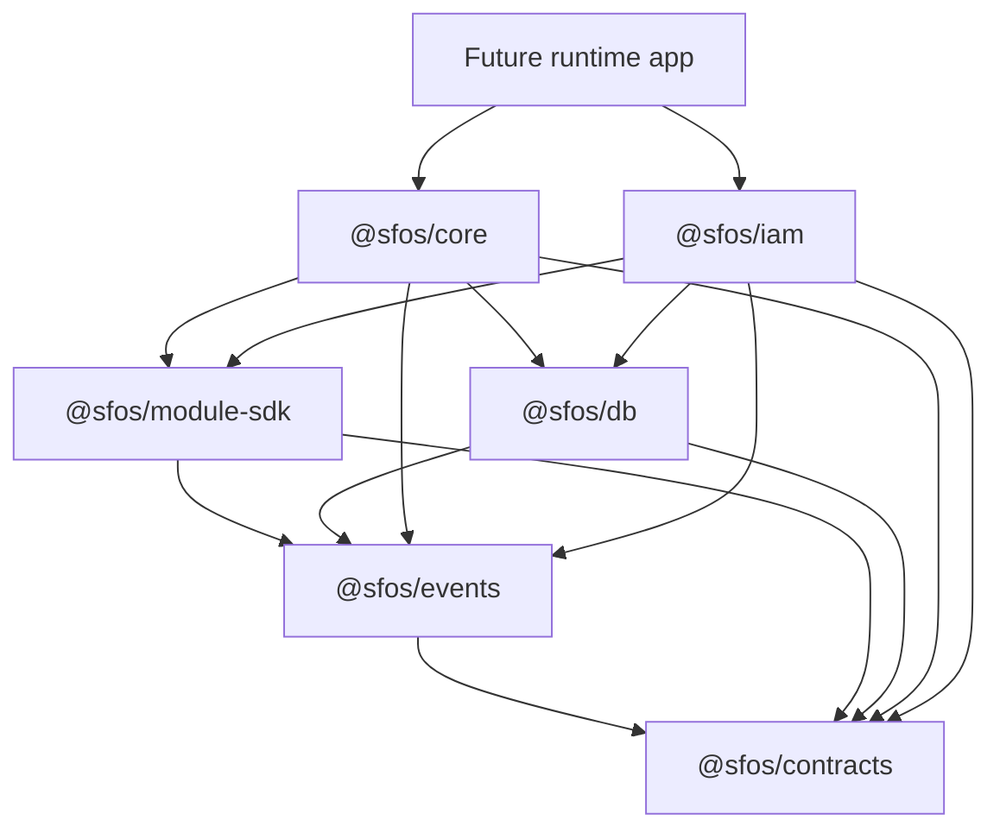

# Codex Handoff

Current-state reference for coding agents. Architecture rules remain canonical in
`ARCHITECTURE.md`, `AGENTS.md`, ADRs, and `docs/architecture/`.

## Purpose

SmartFactory OS is an open-source modular industrial operations platform. It is
a PostgreSQL-first modular monolith designed for cloud, self-hosted, and
workstation deployment.

## Repository Map

| Path                                | Current role                                                                                                      |
| ----------------------------------- | ----------------------------------------------------------------------------------------------------------------- |
| `apps/`                             | Runtime hosts. Empty except `.gitkeep`; BFF/web/worker not implemented.                                           |
| `packages/contracts/`               | Frozen types and schemas: brands, result, manifest, event envelope, platform keys.                                |
| `packages/events/`                  | Event construction, ownership naming checks, ULID helpers.                                                        |
| `packages/module-sdk/`              | Public module lifecycle, contexts, manifest helper, registry interfaces.                                          |
| `packages/db/`                      | Core PostgreSQL schema, RLS helpers, audit/outbox persistence, tenant context.                                    |
| `packages/core/`                    | Bootstrap orchestration, manifest loading, capability graph, registry, lifecycle, event bus, outbox, diagnostics. |
| `modules/module-iam/`               | First operational module: credentials, sessions, invitations, password reset.                                     |
| `tools/generators/module-template/` | Canonical module skeleton. Generator command is not implemented.                                                  |
| `docs/adr/`                         | Accepted structural decisions. Append-only.                                                                       |
| `docs/architecture/`                | Eight canonical architecture documents: blueprint through bootstrap plan.                                         |
| `graphify-out/`                     | Local generated knowledge graph. Ignored by Git.                                                                  |

## Package Graph



Responsibility rule: contracts define truth, DB persists truth, core
orchestrates, modules implement business behavior, and apps compose runtimes.

## Runtime Ownership

- Runtime app imports `@sfos/core` plus module manifests/lifecycles.
- `bootstrap()` validates manifests, resolves capability dependencies,
  registers modules, runs lifecycle hooks, then returns diagnostics.
- Modules never import `@sfos/core`, another module, or an app.
- Cross-module integration uses manifest capabilities, SDK interfaces, events,
  typed APIs, or published read-only views.
- Workspaces may aggregate visibility; they never own operational records.
- Events notify. Only owning modules mutate owned data.
- PostgreSQL RLS is the tenant security floor.

## Enforcement

| Boundary                            | Enforcement                                                        |
| ----------------------------------- | ------------------------------------------------------------------ |
| Package/module/app import direction | `.dependency-cruiser.cjs`, `pnpm validate:deps`                    |
| Within-file import restrictions     | ESLint v9 flat presets in `@sfos/eslint-config`                    |
| Frozen manifest/envelope shapes     | Zod schemas in `@sfos/contracts`                                   |
| Tenant isolation                    | PostgreSQL RLS, `FORCE ROW LEVEL SECURITY`, tenant context helpers |
| Event ownership                     | `@sfos/events`, core event bus checks, module manifests            |
| Data ownership                      | Per-module schemas, migrations, `OWNERSHIP.md`                     |
| Structural decisions                | ADR required before changing frozen architecture                   |

Forbidden directions:

- `packages -> modules|apps`
- `modules -> apps|other modules|@sfos/core`
- `apps -> other apps`
- any circular dependency

## Completed Milestones

- pnpm 9 + Turborepo monorepo and strict TypeScript configuration.
- ESLint v9 flat config and dependency-cruiser boundary enforcement.
- Contracts, events, module SDK, PostgreSQL/RLS foundation, and core runtime.
- IAM auth primitives, sessions, invitations, password reset, manifest,
  permissions, events, migrations, and adversarial test suites.

## IAM Status

`@sfos/iam` owns PostgreSQL schema `module_iam` and tables `credentials`,
`sessions`, `invitations`, and `password_reset_tokens`. It provides
`iam.authentication@1`. Lifecycle currently implements only `preFlight`, requiring
`DATABASE_IAM_URL`.

Unit tests run without PostgreSQL. Integration and adversarial tests require
`TEST_DATABASE_URL`; otherwise Vitest reports explicit skips. GitHub Actions
provides PostgreSQL 16 and runs core plus IAM migrations before tests.

## Validation Pipeline

```text
format:check
  -> lint
  -> typecheck
  -> validate:deps
  -> validate:manifests
  -> validate:events
  -> validate:rls
  -> build
  -> test
```

Commands:

```bash
pnpm format:check
pnpm lint
pnpm typecheck
pnpm build
pnpm validate:deps
pnpm validate
pnpm --filter @sfos/core test
pnpm --filter @sfos/iam test
pnpm db:migrate:test
pnpm test:ci
```

For full DB coverage:

```bash
TEST_DATABASE_URL=postgres://... pnpm --filter @sfos/core test
TEST_DATABASE_URL=postgres://... pnpm --filter @sfos/iam test
```

## Current Issues

- `validate:deps` reports `modules/module-iam/src/ui/placeholder.ts` as an
  orphan warning.
- General module migration aggregation and tenant activation wiring remain
  deferred. CI currently applies core and IAM migrations explicitly through
  the shared migration ledger.
- The ESLint source resolver fix for clean Linux checkouts needs confirmation
  from the next GitHub Actions run.

## Read First

1. `AGENTS.md`
2. `ARCHITECTURE.md`
3. `OWNERSHIP.md`
4. `docs/architecture/README.md`
5. Relevant ADRs under `docs/adr/`
6. Package/module `README.md`, `MODULE.md`, and `OWNERSHIP.md`
7. `.dependency-cruiser.cjs`

## Never Violate

- No architecture redesign without an ADR.
- No cross-module imports, writes, or foreign event emission.
- No module import of `@sfos/core`.
- No tenant-scoped table without forced RLS.
- No state mutation without same-transaction event and audit write.
- No permission/event string literals outside owning constants.
- No `any`, `@ts-ignore`, or unexplained lint suppression.
- No UI direct DB writes, global service locator, hidden DI, or singleton state.
- No secrets, local paths, `.env`, `.claude/`, or generated Graphify output in commits.

## Next Recommended Task

Implement general module migration aggregation and tenant activation wiring.
Do not start the workspace engine before those foundation paths are enforced.
